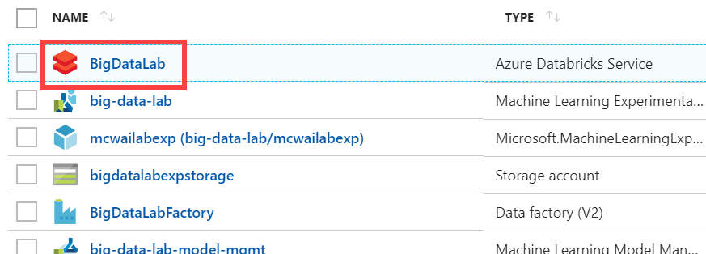

# Deploying Python ML models using Containers

## Configuration of the development environment

Duration: 30 minutes

In this guide, you will set up your development environment for using in the rest of the tutorial.

### Task 1: Provision Azure Databricks

Azure Databricks is an Apache Spark-based analytics platform optimized for Azure. It will be used in this lab to build and train a machine learning model used to predict flight delays.

1. In the [Azure Portal](https://portal.azure.com) (https://portal.azure.com), select **+ Create a resource**, then type "Azure Databricks" into the search bar. Select Azure Databricks from the results.

    

2. Select Create on the bottom of the blade that follows.

3. Set the following configuration on the Azure Databricks Service creation form:

    - Name: Enter a unique name as indicated by a green checkmark.

    - Subscription: Select the subscription you are using for this hands-on lab.

    - Resource Group: Select the same resource group you created at the beginning of this lab.

    - Location: Select a region close to you. ***(If you are using an Azure Pass, select South Central US)***

    - Pricing: Select Standard.

    

4. Select **Create** to finish and submit.

### Task 2: Create Azure Storage account

Create a new Azure Storage account that will be used to store historic and scored flight and weather data sets for the lab.

1. In the [Azure Portal](https://portal.azure.com) (https://portal.azure.com), select **+ Create a resource**, then type "storage" into the search bar. Select **Storage account - blob, file, table, queue** from the results.

    

2. Select Create on the bottom of the blade that follows.

3. Set the following configuration on the Azure Storage account creation form:

    - Subscription: Select the subscription you are using for this hands-on lab.

    - Resource group: Select the same resource group you created at the beginning of this lab.

    - Storage account name: Enter a unique name as indicated by a green checkmark.

    - Location: Select the same region you used for Azure Databricks.

    - Performance: Standard

    - Account kind: BlobStorage

    - Replication: Read-access geo-redundant storage (RA-GRS)

    - Access tier: Hot

    

4. Select **Create** to finish and submit.

### Task 3: Retrieve Azure Storage account information and create container

You will need to have the Azure Storage account name and access key when you create your Azure Databricks cluster during the lab. You will also need to create storage containers in which you will store your flight and weather data files.

1. From the side menu in the Azure portal, choose **Resource groups**, then enter your resource group name into the filter box, and select it from the list.

2. Next, select your lab Azure Storage account from the list.

    

3. Select **Access keys** (1) from the menu. Copy the **storage account name** (2) and the **key1** key (3) and copy the values to a text editor such as Notepad for later.

    

4. Select **Blobs** (1) from the menu. Select **+ Container** (2) on the Blobs blade, enter **sparkcontainer** for the name (3), leaving the public access level set to Private. Select **OK** (4) to create the container.

    

### Task 4: Create an Azure Databricks cluster

You have provisioned an Azure Databricks workspace, and now you need to create a new cluster within the workspace. Part of the cluster configuration includes setting up an account access key to your Azure Storage account, using the Spark Config within the new cluster form. This will allow your cluster to access files from inside the Azure Storage.

1. From the side menu in the Azure portal, select **Resource groups**, then enter your resource group name into the filter box, and select it from the list.

2. Next, select your Azure Databricks service from the list.

    

3. In the Overview pane of the Azure Databricks service, select **Launch Workspace**.

    

    Azure Databricks will automatically log you in using Azure Active Directory Single Sign On.

    

4. Select **Clusters** (1) from the menu, then select **Create Cluster** (2).

    

5. On the Create New Cluster form, provide the following:

    - Cluster Name: lab

    - Cluster Type: Standard

    - Databricks Runtime Version: 4.3 (includes Apache Spark 2.3.1, Scala 2.11)

    - Python Version: 3

    - Driver Type: Same as worker

    - Worker Type: Standard_F4s

    - Workers: 1

    - Enable Autoscaling: Uncheck this option

    - Auto Termination: Check the box and enter 120

    - Spark Config: Edit the Spark Config by entering the connection information for your Azure Storage account that you copied earlier in Task 5. This will allow your cluster to access the lab files. Enter the following:

        `spark.hadoop.fs.azure.account.key.<STORAGE_ACCOUNT_NAME>.blob.core.windows.net <ACCESS_KEY>`, where <STORAGE_ACCOUNT_NAME> is your Azure Storage account name, and <ACCESS_KEY> is your storage access key.

    **Example:** `spark.hadoop.fs.azure.account.key.bigdatalabstore.blob.core.windows.net HD+91Y77b+TezEu1lh9QXXU2Va6Cjg9bu0RRpb/KtBj8lWQa6jwyA0OGTDmSNVFr8iSlkytIFONEHLdl67Fgxg==`

   

6. Select **Create Cluster**.

You should follow all these steps provided _before_ attending the Hands-on lab.

### Task 5: Install the Azure ML SDK in the Cluster
You have provisioned an Azure Databricks cluster, and now you need to attach the Azure Machine Learning SDK PyPi package to the cluster.

1. Select **Workspace** from menu, then Right-click in any folder where you want to store the `azureml-core` library.

2. Select **Create > Library**.

3. Select **Upload Python Egg or PyPI** from the Language Menu. In the PyPi package name type `azureml-sdk[databricks]==1.0.2`. Install the library and attach it to the created cluster.

For a better understanding of this task, read this [documentation reference](https://docs.microsoft.com/en-us/azure/machine-learning/service/how-to-configure-environment#azure-databricks).

#### *You should follow all these steps provided before executing the YOLO deployment code.*
